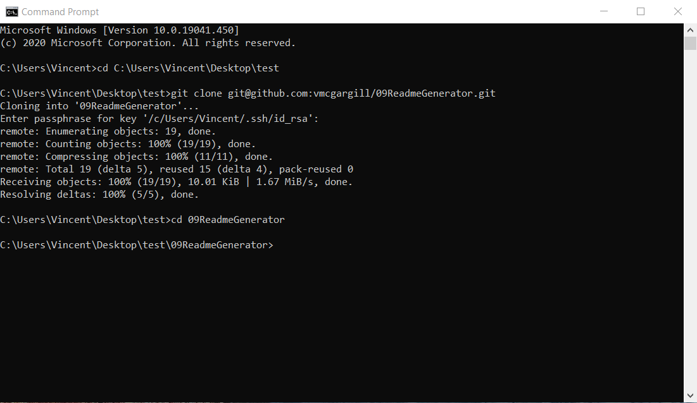
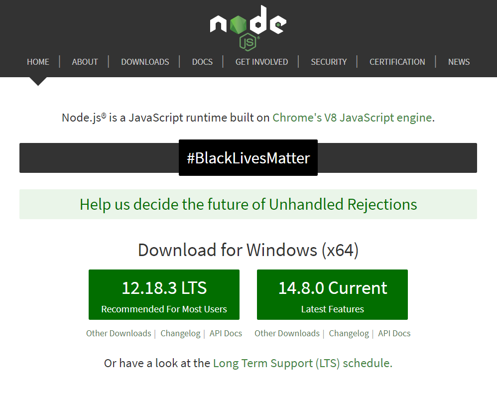
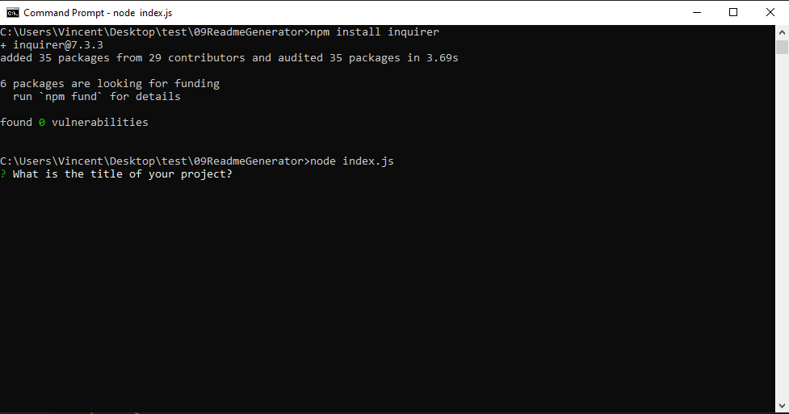
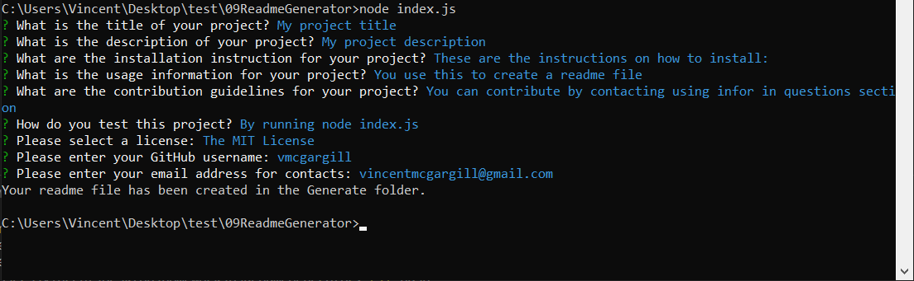
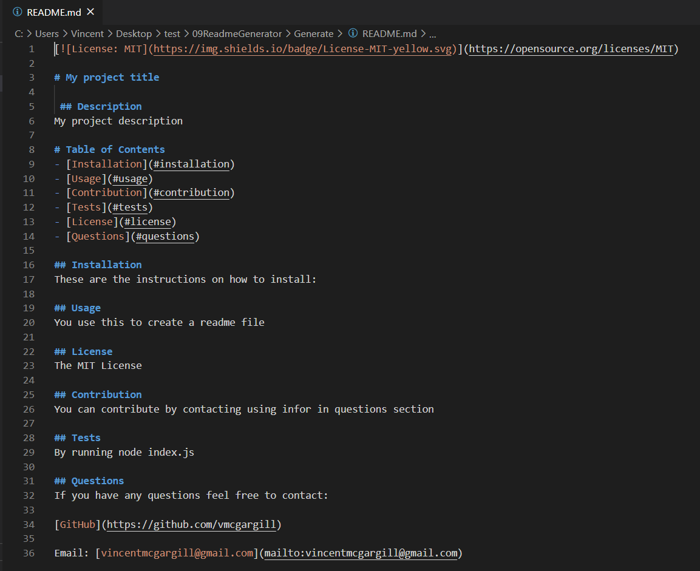

[](http://unlicense.org/)

# README Generator
 
 ## Description 
This application is a README.md generator that automates the process of creating a README.md file by skipping the steps of creating badges, adding headers, and creating a table of contents. It makes creating README.md files a lot easier. The application uses Node.js and npm. It is entirely written in JavaScript. The very README.md file that you are reading right now was generated by this program!
 
# Table of Contents 
- [Installation](#installation) 
- [Usage](#usage) 
- [Contribution](#contribution) 
- [Tests](#tests) 
- [License](#license) 
- [Questions](#questions) 
 
## Installation

If you are looking to use this command line application to create your own README.md file, please follow all 4 of the following steps:

#### Step 1: 

Clone the project from github. If you are cloning via SSH:

```
git clone git@github.com:vmcgargill/09ReadmeGenerator.git 
```

If you are cloning via HTTPS:

```
git clone https://github.com/vmcgargill/09ReadmeGenerator.git
```

Or you can download the [GitHub Repository](https://github.com/vmcgargill/09ReadmeGenerator) directly from GitHub. 

After your repository has be cloned/downloaded, CD into it's directory.



#### Step #2:

Make sure you have node.js installed on your computer. If it is not installed then you may install it here:

[Node.js website](https://nodejs.org/en)



#### Step #3: 

Inside the GitHub repository you just cloned in [Step 1](####Step1:), install Inquirer.js using NPM by entering the following command:

```
npm install inquirer
```

Then run the index.js file using node by entering the following command: 

```
node index.js
``` 



#### Step #4:

Enter in the confirmations as prompted. Provide you project title, description, installation instructions, usage, select a license, enter your contribution guidelines, and explain how to test. 



After that your REAME.md file will be generated and will show up in a folder called "Generate". You're good to go! 


 
## Usage 
This application is intended to be used to create a README.me file easily via the command line.

## License
This application is unlicensed, it is a class project and it is free to use for anyone. To see a full list of license badges used to create this application, [click here](https://gist.github.com/lukas-h/2a5d00690736b4c3a7ba).
 
## Contribution 
If you would like to contribute, please reach out using the contact info in the questions section.
 
## Tests 
First install node.js on your computer if you have not already. Then clone the repository from GitHub. Finally, open the repository folder in the command line and run index.js. After you entered all the commands, check for the folder that says "Generate" for a README.md file to see your generated README. Refer to the [Installation](#Installation) section of this README for more detailed directions.

## Video Example

[Click here to view YouTube video example](https://youtu.be/NHmEnpzxq6I)

## Questions 
If you have any questions feel free to contact: 

[GitHub](https://github.com/vmcgargill) 

Email: [vincentmcgargill@gmail.com](mailto:vincentmcgargill@gmail.com)